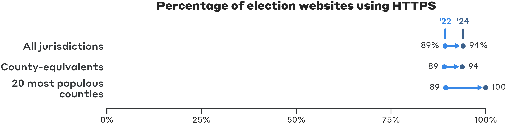

# Election Office Website Adoption of .gov and HTTPS

This repository contains the code for the analysis described in the July 2024 Bipartisan Policy Center blog post, "[More Election Offices are Adopting Verified, .gov Websites.](https://bipartisanpolicy.org/blog/more-election-offices-are-adopting-verified-gov-websites)" It does not contain the dataset itself, which is maintained by the [Center for Tech and Civic Life](https://www.techandciviclife.org/).

## Results

***

